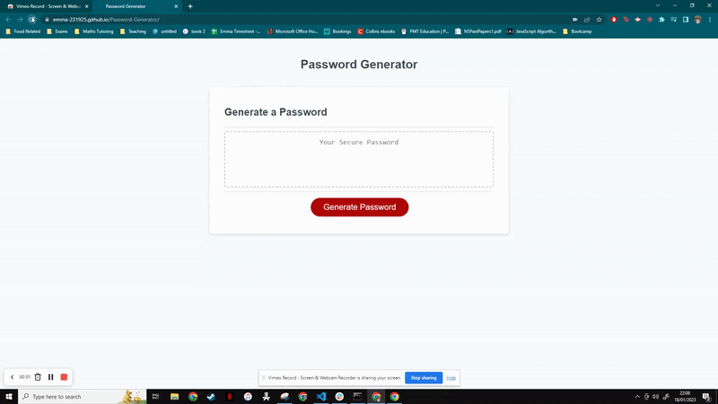

# Password-Generator

## Description

The aim of this project was to create a password generator that took user inputs on character type and password length, then printed a randomly created password accordingly. This project allows the user to generate a random password but allows them to choose the password length and if they want the following characters:

 - Uppercase
 - Lowercase
 - Numerical
 - Special

I built this project to further improve my JavaScript skills and apply my new knewledge of functions, alerts/prompts and while loops to a project. I was able to write functions for each part of the code and learnt how to debug different errors associated with global vs local variables. As well as this, I used while loops alongside prompts to ensure that the user is entering a valid input.

## Installation

N/A

## Usage

To access this webpage, please use the following URL: (https://emma-231925.github.io/Password-Generator/)

Checkout the following GIF that shows the functionality of the webpage:

## Credits

N/A

## License

Please refer to LICENSE in repo.